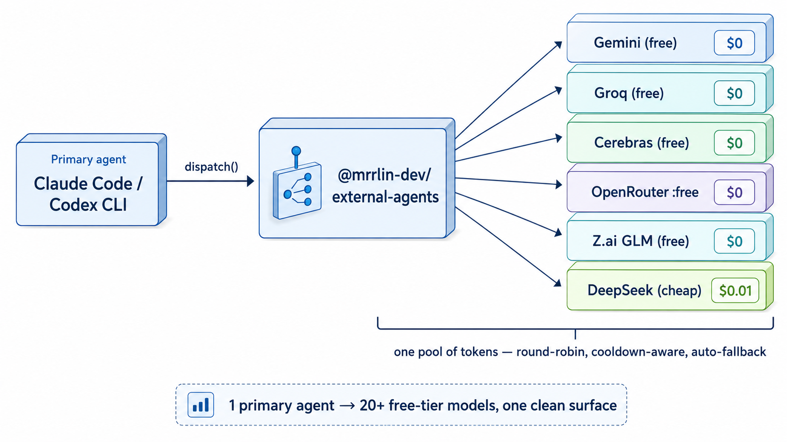
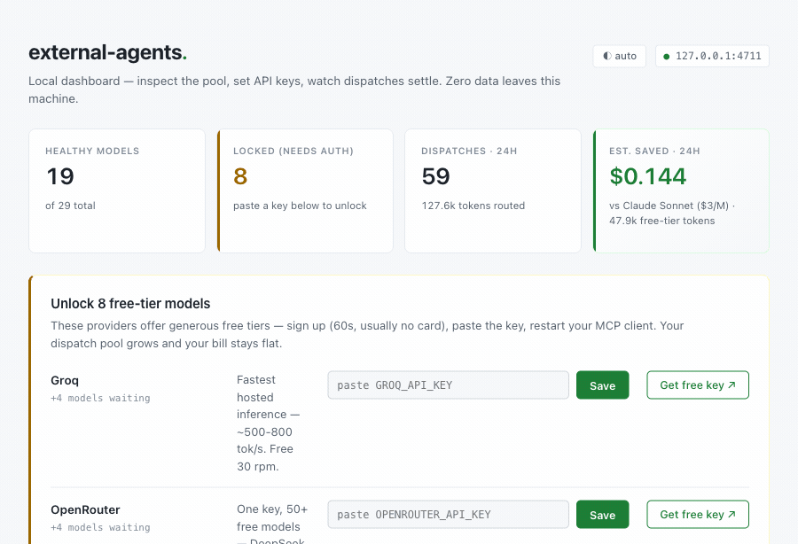

# @mrrlin-dev/external-agents

[](#-2-minute-setup)
[](#-2-minute-setup)
[](#-2-minute-setup)
[](https://www.npmjs.com/package/@mrrlin-dev/external-agents)

**Route work from your coding agent across 20+ free-tier LLMs. Cut your bill 10-100×.**



Your Google + Groq + OpenRouter + Ollama Cloud free tiers all have **separate quota buckets**. `external-agents` treats them as one pool: round-robin dispatch, cooldown-aware, auto-fallback on 429. Same agentic workload that used to cost $10-100/day on one paid model runs at effectively $0. Also the perfect substrate for [LLM-Council](https://github.com/karpathy/llm-council)-style multi-model panels — `pick_agents` gives you N distinct-provider picks in one call.

---

## 🚀 2-minute setup

```bash
curl -fsSL https://raw.githubusercontent.com/mrrlin-dev/external-agents/main/install.sh | bash
```

That's it. The script installs the package, registers the MCP server with Claude Code + Codex (whichever you have), and opens the local dashboard so you can paste free-tier API keys inline:



Sign up (60 sec, usually no card), paste, Save, restart your MCP client. Done. **Every new key adds a provider to the round-robin pool.**

<details>
<summary>Or wire it up manually (three commands)</summary>

```bash
npm install -g @mrrlin-dev/external-agents

# Register with whichever host(s) you use
claude mcp add external-agents external-agents-mcp
codex  mcp add external-agents -- external-agents-mcp

# Set up keys
external-agents init      # opens http://127.0.0.1:4711
```

Requires Node ≥ 20. Works on macOS and Linux; Windows via WSL.

</details>

---

## What you get

- **`dispatch(agent_id, prompt)`** — an MCP tool your primary agent calls. Auto-picks a healthy provider, retries on a different one if the first is rate-limited, honors the provider's own reset time (not a made-up 1h default).
- **`pick_agents(n, min_distinct_providers)`** — the primitive for multi-model panels. Fan out 2-4 distinct-provider votes in parallel for jury-style review, self-consistency checks, or your own consensus loop.
- **Local dashboard** — `external-agents init` opens a loopback page where you paste keys inline, see live provider state, and check usage. Loopback only, never over the network, keys stored at `~/.local/state/external-agents/keys.env` (mode 0600).

Your primary agent (Claude Code, Codex, Cursor) gets these as MCP tools automatically after the setup script above.

---

## Providers in the pool (out of the box, 28 agents)

| | | |
|---|---|---|
| **Gemini** (Google AI Studio) | **Groq** | **OpenRouter** :free |
| 7 model variants, per-model quota | 4 models incl. gpt-oss 120B/20B | 6 :free models incl. Nvidia Nemotron 550B |
| **Ollama Cloud** | **DeepSeek** | **Anthropic Claude** |
| gpt-oss 20B/120B via local daemon | Cheap direct API (v4-flash + v4-pro) | Subscription (Opus 4.8/4.7 + Sonnet 5 + Haiku 4.5) |
| **Codex** | **cursor-agent** | **opencode** |
| Subscription (GPT-5 family) | CLI agentic reviewer | CLI agentic reviewer |
| **kiro-cli** | | |
| AWS Kiro headless | | |

_Cerebras dropped in 0.13.0 and Z.ai in this release — both require paid plans now, no usable free tier. Add locally via `add-model` if you have a paid plan._

Missing a provider? [Suggest it](https://github.com/mrrlin-dev/external-agents/issues/new?labels=missing-model) — the built-in UI has a form that opens a pre-filled issue.

### Keeping the list honest

Registry lives inside the package — `npm i -g @mrrlin-dev/external-agents@latest` gets you the curated, tested list. What matters day-to-day is knowing whether **your account** still has access to each model (providers deprecate models, free tiers rotate).

**`external-agents audit [--provider P] [--json]`** — force a real API round-trip for every entry that has a `generate_new` transport. Detects three classes of drift in one pass:

- `✓ healthy` — key works, model exists
- `⚠ needs_auth` — 401 / 403 (paste or refresh the key)
- `✗ model_unavailable` — key is fine but this specific model isn't on your tier (e.g. Cerebras deprecated a model)
- `⏳ rate_limited` — hit the free-tier ceiling, will recover

Runs concurrent per provider to respect rate limits. Writes verdicts to `state.json` — the UI and dispatch pick immediately reflect ground truth. `--provider google` narrows to one bucket.

**`external-agents add-model`** — add your own entry (internal endpoint, beta model, whatever) without touching the package:
```bash
external-agents add-model \
  --id kimi-k2-instruct \
  --provider groq \
  --model moonshotai/kimi-k2-instruct \
  --url https://api.groq.com/openai/v1/chat/completions \
  --env GROQ_API_KEY \
  --tags free,fast
```
Writes to `~/.local/state/external-agents/agents.local.yaml`, layered on top of the bundled registry (same-id replaces, new-id appends).

---

## Routing philosophy — be smart, not lavish

`pick_agents` defaults to `tier: "weak"` on purpose. **Most tasks don't need a frontier model.**

Single-file edits, refactors, glue code, summaries, format conversions, well-scoped bug fixes, docstring generation, test-case writing — a Gemini Flash, Groq Llama, DeepSeek, or OpenRouter :free model gets you the same correct answer as Claude Opus 4.8 or Codex Pro, at a fraction of the time and cost. This isn't an opinion — it's how the pool is built to be used.

Reach for **strong-tier** (Claude Opus, Codex Pro, DeepSeek Reasoner, Nemotron Ultra) only when the task is genuinely one of these:

- Multi-step debugging with unclear root cause
- Architecture / API-shape decisions
- Novel algorithms or math-heavy transforms
- Ambiguous requirements that need the model to disambiguate

If a weak-tier agent gets the answer wrong, the **first move is to sharpen the spec, not escalate tier**. `escalate_to_pro` is a retry lever, not a default. Reaching for a stronger model hides prompt-engineering failures behind expensive compute — and you'll be doing it every time until the spec is fixed anyway.

The `dispatch` and `pick_agents` MCP tools carry this guidance in their descriptions so any LLM caller reading the tool schema at runtime picks up the same routing bias.

---

## Mrrlin uses this

[Mrrlin](https://mrrlin.com) is the platform this was extracted from. Its consensus gate — every design and every PR diff — runs a 4-reviewer panel: GPT + Gemini over MCP + **two dynamic terminal reviewers pulled from this exact pool** every round. Free-tier terminals mean the gate is essentially free to run on every substantial change, and cross-model diversity beats any single-model reviewer.

You don't need Mrrlin's gate to use the pattern. Build your own reviewer panel, self-consistency check, jury-of-N verifier — the primitives are unopinionated.

---

## FAQ

<details>
<summary><b>Do you send my API keys anywhere?</b></summary>

No. Keys live in `~/.local/state/external-agents/keys.env` (mode 0600, loopback-set) and are read into the MCP server's env at startup. Subscription tokens live where the subscription CLI puts them (`codex login`, `claude login`). Nothing is ever transmitted by `external-agents` itself.

</details>

<details>
<summary><b>How does <code>claude mcp add</code> find <code>external-agents-mcp</code>?</b></summary>

`npm i -g` puts a symlink to `external-agents-mcp` on your global bin dir (usually `/opt/homebrew/bin` on macOS, `/usr/local/bin` on Linux). That dir is on your `PATH`. `claude mcp add` writes the literal string `external-agents-mcp` into `~/.claude.json`; when Claude Code starts, it spawns that as a child process — shell PATH resolution finds the binary. No hosting, no daemon, no registry lookup.

</details>

<details>
<summary><b>How does it handle 429s?</b></summary>

Every real call updates state from response headers and error signals. Cooldown honors the provider's own reset time (parsed from `x-ratelimit-reset-*`, `Retry-After`, and error bodies). If Google says "resets in 42h", we wait 42h — not a 1h fallback.

</details>

<details>
<summary><b>Can I use this with just a subscription (no API keys)?</b></summary>

Yes — Codex subscription and Claude subscription are registered as `cli:*` entries. Zero API-key setup for those cases. Free-tier providers stack on top.

</details>

<details>
<summary><b>Is Mrrlin required?</b></summary>

No. `external-agents` is standalone. Mrrlin uses it internally, but the package works for anyone building a multi-model workflow.

</details>

<details>
<summary><b>What about adding a new provider?</b></summary>

~15-line YAML addition — see [docs/adding-a-provider.md](docs/adding-a-provider.md). aider (used for `edit_exists` transport) supports 100+ providers via LiteLLM.

</details>

---

## About Mrrlin

`external-agents` is one piece of [**Mrrlin**](https://mrrlin.com) — an AI orchestration platform for solo developers and small teams. If you like this package, you'll probably like the rest of Mrrlin.

## License

MIT. Contributions welcome — see [CONTRIBUTING.md](CONTRIBUTING.md).
