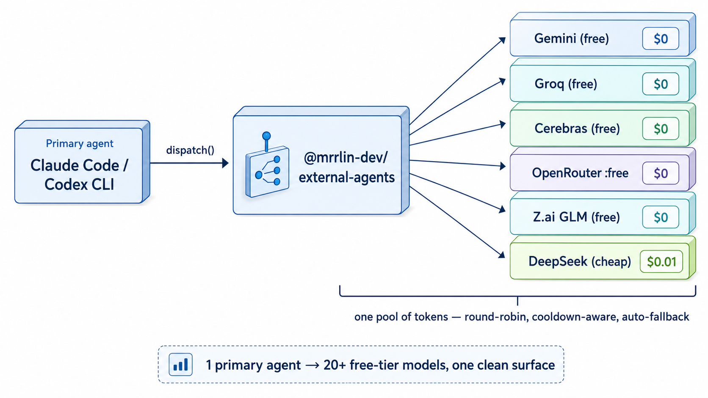
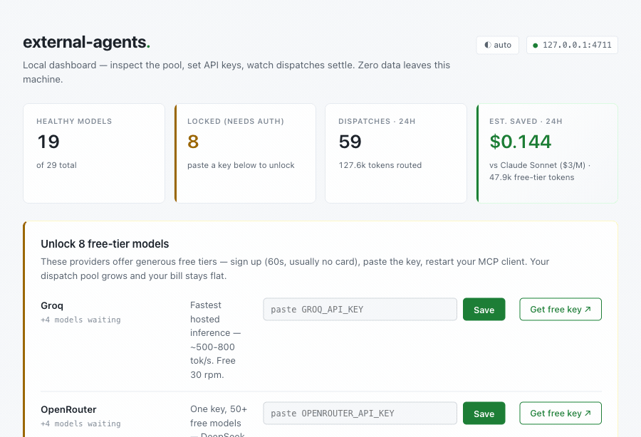

# @mrrlin-dev/external-agents — Multi-LLM MCP Server

[](#-2-minute-setup)
[](#-2-minute-setup)
[](#-2-minute-setup)
[](https://www.npmjs.com/package/@mrrlin-dev/external-agents)

**Give your coding agent a pool of 40+ cheaper models to hand work off to. Cut your bill 10-100×.**

Changelog: [CHANGELOG.md](CHANGELOG.md)



## The problem this solves

You run Claude Code or Codex all day. Most of what it does — reading files to answer one question, running a test suite, renaming a symbol across 30 files, summarizing a diff — does not need a frontier model. But it all bills at frontier prices, on one account, against one rate limit.

Meanwhile you probably already have a handful of separate, mostly-free quota buckets sitting idle: a Google AI Studio key, a Groq key, OpenRouter's `:free` models, whatever agentic CLIs you're logged into.

`external-agents` turns those into one pool your primary agent can dispatch into. It picks a healthy provider per call, round-robins across buckets, and when one returns 429 it moves to a different provider and honors that provider's real reset time.

It's also a clean substrate for [LLM-Council](https://github.com/karpathy/llm-council)-style panels: one `pick_agents` call gives you N picks from N *distinct* providers, so a jury of models isn't secretly the same model four times.

---

## 🚀 2-minute setup

```bash
curl -fsSL https://raw.githubusercontent.com/mrrlin-dev/external-agents/main/install.sh | bash
```

The script installs the package, registers the MCP server with Claude Code and/or Codex (whichever it finds), and opens a local dashboard where you paste provider keys inline:



Then restart your MCP client. Your agent now has the tools.

<details>
<summary>Or wire it up manually (three commands)</summary>

```bash
npm install -g @mrrlin-dev/external-agents

# Register with whichever host(s) you use
claude mcp add external-agents external-agents-mcp
codex  mcp add external-agents -- external-agents-mcp

# Set up keys
external-agents ui        # opens http://127.0.0.1:4711
```

Requires Node ≥ 20. Works on macOS and Linux; Windows via WSL.

</details>

### How much do I have to set up before this is useful?

Nothing, if you're already logged into an agentic CLI. Entries backed by a subscription you already have — `claude`, `codex`, `cursor-agent`, `ollama`, `opencode`, `kiro-cli`, `agy` — need no API key at all; they're usable the moment the binary is on your `PATH` and logged in.

Everything else is incremental. Each key you paste lights up more of the pool, and none of them are required:

| Paste this | Get | Cost |
|---|---|---|
| `GEMINI_API_KEY` (Google AI Studio) | Gemini Flash | Free tier, no card |
| `GROQ_API_KEY` | Llama 3.3 70B, gpt-oss 120B/20B, Llama 3.1 8B | Free tier, no card |
| `OPENROUTER_API_KEY` | 5 `:free` models incl. Nemotron Ultra | Free tier, no card |
| `DEEPSEEK_API_KEY` | DeepSeek v4 flash + v4 pro (reasoner) | Prepaid, needs a small top-up |

Signup for each is about a minute. The dashboard links straight to the right page and has a paste box next to it.

---

## What your agent gets

Two MCP tools, available automatically after setup:

- **`dispatch(agent_id, prompt)`** — run a prompt on a specific pool member. Auto-retries on a different provider if the first is rate-limited, and honors the provider's own reset time rather than a made-up 1-hour default.

  Pass `cwd` (an existing directory — a git worktree, say) and a direct CLI will inspect and edit files in place. `cwd` does **not** grant filesystem access to HTTP-based models; give those context with `files` instead. When `cwd` is a git repo, the `files` list that comes back is the git-changed set, not the whole tree.

- **`pick_agents(n, min_distinct_providers)`** — ask for N healthy agents from N different providers. This is the primitive for fan-out: jury-style review, self-consistency checks, your own consensus loop.

Both tools carry the routing guidance below in their descriptions, so any model reading the schema at runtime picks up the same bias.

Everything is also available from the terminal — `external-agents pick`, `dispatch`, `status`, `stats`, `audit` — if you'd rather script it than go through MCP. Run `external-agents` with no arguments for the full list.

---

## What's in the pool

42 bundled entries, 32 enabled out of the box. The rest are paid upgrades that stay off until you explicitly opt in.

| Provider | Entries | What you need |
|---|---|---|
| **Google AI Studio** | Gemini 3.6 Flash ×8 slots, Gemini 3.1 Pro ×8 (off — paid) | `GEMINI_API_KEY`, free tier |
| **Groq** | Llama 3.3 70B, gpt-oss 120B, gpt-oss 20B, Llama 3.1 8B | `GROQ_API_KEY`, free tier |
| **OpenRouter** | 5 `:free` models incl. Nemotron Ultra & Super, Gemma 4, gpt-oss 20B | `OPENROUTER_API_KEY`, free tier |
| **Antigravity** | Gemini Flash/Pro, Claude Sonnet 4.6, Claude Opus 4.6, gpt-oss 120B | `agy` CLI, logged in |
| **Anthropic** | Claude Opus 4.8, Sonnet 5, Haiku 4.5 | `claude` CLI subscription |
| **Codex** | GPT-5.4 (CLI default) and GPT-5.4-mini | `codex` CLI subscription |
| **Ollama Cloud** | gpt-oss 20B, gpt-oss 120B | `ollama` CLI |
| **DeepSeek** | v4-flash, v4-pro (both **off until you add a key**) | `DEEPSEEK_API_KEY`, prepaid |
| **cursor-agent / opencode / kiro-cli** | one agentic CLI reviewer each | the respective CLI |

Why eight Google slots: Google AI Studio can rate-limit an entire *project* at once, separately from each model's own per-minute limit — so a second project's key on the same account is a genuinely independent bucket. The dashboard's "+ Add another key" adds one whenever you have another to give it. One key is perfectly fine; the other seven slots just sit unused.

DeepSeek ships disabled because its API is prepaid — with no key and no balance it can't answer anything, so it stays out of your pool until you add `DEEPSEEK_API_KEY`, at which point both entries turn themselves on.

_Cerebras (removed in 0.13.0) and Z.ai (removed in 0.22.0) are no longer bundled — both need paid-provider setup. Add them back locally with `add-model` if you have a plan._

Missing a provider? [Suggest it](https://github.com/mrrlin-dev/external-agents/issues/new?labels=missing-model) — the dashboard has a form that opens a pre-filled issue.

---

## Keeping the pool honest

Providers deprecate models, free tiers rotate, keys expire. The bundled registry tells you what *exists*; only a real call tells you what **your account** can still reach.

```bash
external-agents audit                 # every entry with an HTTP transport
external-agents audit --provider google   # just one bucket
```

One round-trip per entry, concurrent per provider so you don't trip rate limits, and the verdicts are written to `state.json` — so the dashboard and dispatch immediately reflect ground truth:

- `✓ healthy` — key works, model exists
- `⚠ needs_auth` — 401/403, paste or refresh the key
- `✗ model_unavailable` — key is fine, this model isn't on your tier
- `⏳ rate_limited` — hit the current limit, will recover

Day to day, `external-agents ui` is the same information as a page: live provider state, usage, and a paste box per provider. It binds to loopback only. Individual entries have an on/off switch (`external-agents toggle <id> --disabled`) if you want one out of rotation without deleting anything.

### Adding your own model

An internal endpoint, a beta model, anything not bundled:

```bash
external-agents add-model \
  --id kimi-k2-instruct \
  --provider groq \
  --model moonshotai/kimi-k2-instruct \
  --url https://api.groq.com/openai/v1/chat/completions \
  --env GROQ_API_KEY \
  --tags free,fast
```

That writes to `~/.local/state/external-agents/agents.local.yaml`, layered over the bundled registry — same id replaces, new id appends. Package upgrades never clobber it. Full walkthrough: [docs/adding-a-provider.md](docs/adding-a-provider.md).

---

## Routing philosophy — be smart, not lavish

`pick_agents` defaults to `tier: "weak"` on purpose. **Most tasks don't need a frontier model.**

Single-file edits, refactors, glue code, summaries, format conversions, well-scoped bug fixes, docstrings, test cases — a Gemini Flash, Groq Llama, DeepSeek, or OpenRouter `:free` model gets you the same correct answer as Claude Opus or Codex Pro, faster and for a fraction of the cost.

Reach for **strong tier** (Claude Opus, Codex, DeepSeek Reasoner, Nemotron Ultra) when the task is genuinely one of these:

- Multi-step debugging with an unclear root cause
- Architecture or API-shape decisions
- Novel algorithms, math-heavy transforms
- Ambiguous requirements the model has to disambiguate

If a weak-tier agent gets it wrong, **the first move is to sharpen the spec, not escalate the tier**. `escalate_to_pro` is a retry lever, not a default — reaching for a bigger model hides prompt-engineering failures behind expensive compute, and you'll pay for it on every subsequent call too.

Related: `--effort <level>` controls reasoning depth where the provider supports it. Use `high` for planning, design, and review; leave it off for mechanical edits. See [docs/effort.md](docs/effort.md) for the verified per-agent table.

---

## FAQ

<details>
<summary><b>Do you send my API keys anywhere?</b></summary>

No. Keys live in `~/.local/state/external-agents/keys.env` (mode 0600) and are read into the MCP server's environment. The dashboard that accepts them binds to loopback only, never to a network interface. Subscription tokens stay wherever their own CLI put them (`codex login`, `claude login`) — this package never reads or moves them. Nothing is transmitted anywhere except to the provider you're dispatching to.

</details>

<details>
<summary><b>Can I use this with no API keys at all?</b></summary>

Yes, if you're logged into at least one agentic CLI — `claude`, `codex`, `cursor-agent`, `ollama`, `opencode`, `kiro-cli`, or `agy`. Those entries are subscription-backed and need zero key setup. Free-tier API providers stack on top whenever you feel like adding them.

</details>

<details>
<summary><b>I added a key but the dashboard still says "not set".</b></summary>

Reload the page — since 0.39.0 the dashboard and the MCP server re-read the key store on every request, so a key added from a terminal shows up on the next poll. If it persists, the value is probably being shadowed by the same variable exported in your own shell, which always wins over the stored one.

</details>

<details>
<summary><b>How does it handle 429s?</b></summary>

Every real call updates state from the response headers and error body. Cooldown uses the provider's own reset time, parsed from `x-ratelimit-reset-*`, `Retry-After`, and error payloads. If Google says the quota resets in 42 hours, it waits 42 hours instead of guessing an hour and hammering a wall.

</details>

<details>
<summary><b>How does <code>claude mcp add</code> find <code>external-agents-mcp</code>?</b></summary>

`npm i -g` symlinks `external-agents-mcp` into your global bin directory (usually `/opt/homebrew/bin` on macOS, `/usr/local/bin` on Linux), which is on your `PATH`. `claude mcp add` writes that literal string into `~/.claude.json`, and Claude Code spawns it as a child process — ordinary PATH resolution. No hosting, no daemon, no registry lookup.

</details>

<details>
<summary><b>Is Mrrlin required?</b></summary>

No. `external-agents` is standalone and works for anyone building a multi-model workflow. Mrrlin just happens to be where it was extracted from.

</details>

---

## Mrrlin uses this

[Mrrlin](https://mrrlin.com) is the platform this was extracted from. Its consensus gate — run on every design and every PR diff — is a four-reviewer panel, with reviewers pulled dynamically from this exact pool each round. Free-tier members mean the gate costs essentially nothing to run on every substantial change, and cross-model diversity beats any single reviewer.

You don't need Mrrlin to use the pattern. Build your own reviewer panel, self-consistency check, or jury-of-N verifier — the primitives are unopinionated.

`external-agents` is one piece of [**Mrrlin**](https://mrrlin.com), an AI orchestration platform for solo developers and small teams.

## License

MIT. Issues and pull requests welcome.
